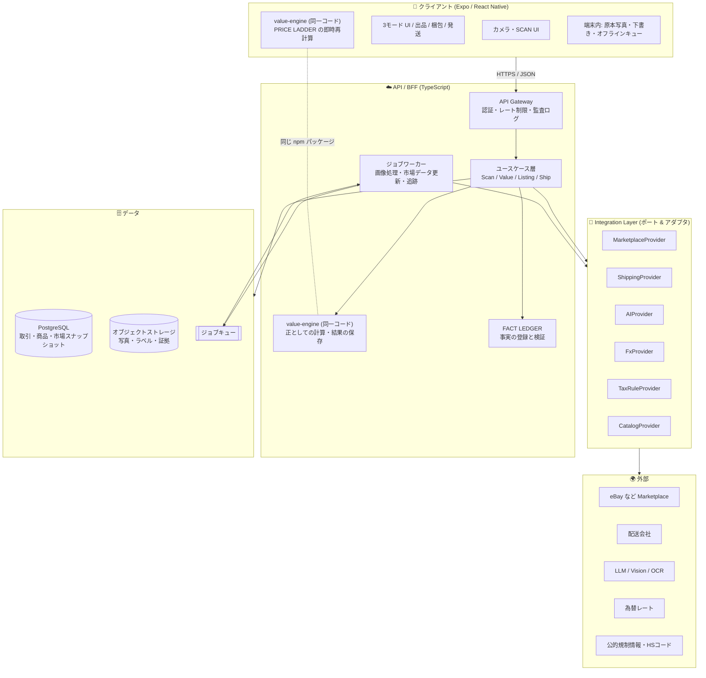
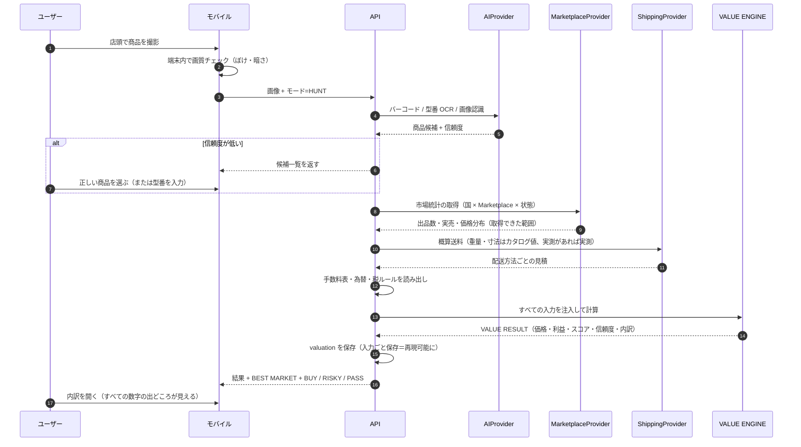
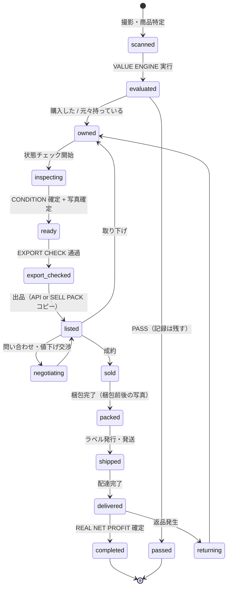

# 01. プロダクト全体アーキテクチャ

## 1. 設計の出発点

依頼の第 59 節にある通り、**UI より先に VALUE ENGINE を独立した Domain として設計する。**
この 1 点がアーキテクチャ全体を決めている。

- NEW BUY / MY STUFF / HUNT は **VALUE ENGINE の 3 つの呼び出し方**であって、3 つの機能ではない。
- したがって、モードごとに価格ロジックを書かない。**書けない構造にする。**
- VALUE ENGINE は**ネットワークにも DB にも触らない純粋な関数群**とする。
  必要なデータ（市場統計・手数料表・送料見積・為替）はすべて引数として注入する。

この形にすると、次が同時に手に入る。

| 得られること | 理由 |
|---|---|
| 計算のテストが容易 | 外部依存ゼロ。固定入力 → 固定出力のテーブルテストが書ける |
| PRICE LADDER が即時応答 | 同じエンジンを端末側で実行し、スライダー操作で毎回サーバーに問い合わせない |
| 算出根拠が必ず残る | 入力を丸ごと保存すれば、後から同じ結果を再現できる |
| AI が数字を作れない | 数値の出力経路がエンジンにしか存在しない（禁止事項 N-1） |

---

## 2. 全体構成



### レイヤーの責務

| レイヤー | 責務 | やってはいけないこと |
|---|---|---|
| クライアント | 撮る・見せる・確認させる。即時の再計算 | 外部 API キーを持つ。最終的な金額の確定 |
| API / ユースケース層 | 手順の組み立て、権限、保存、監査 | 価格の計算式を書く（エンジンの仕事） |
| **VALUE ENGINE** | 価格・利益・スコア・信頼度の計算 | I/O。時刻の取得すら引数で受ける |
| Integration Layer | 外部差異の吸収。取得できないことの明示 | 取得できない値を推定で埋める |
| データ層 | 事実と結果の永続化 | ビジネス判断 |

---

## 3. モノレポ構成（案）

```
global-treasure/
├─ apps/
│  ├─ mobile/           # Expo (React Native)。カメラ中心の本体
│  └─ api/              # Fastify + TypeScript。BFF 兼ドメインサービス
├─ packages/
│  ├─ value-engine/     # ★ 純粋関数。依存ゼロ。端末とサーバーの両方で動く
│  ├─ domain/           # 型・列挙・状態遷移（Item / Listing / Shipment）
│  ├─ fact-ledger/      # 事実の登録・検証・出品文の検証器
│  ├─ integrations/     # Provider インターフェース定義
│  │  ├─ marketplace/   #   ports + adapters/ebay, adapters/manual...
│  │  ├─ shipping/      #   ports + adapters/...
│  │  ├─ ai/            #   ports + adapters/...
│  │  └─ reference/     #   為替 / 税 / 規制 / カタログ
│  ├─ config-registry/  # Marketplace 仕様・手数料表（設定として管理: GT-F26）
│  └─ ui/               # 共有 UI プリミティブ
└─ docs/                # 本設計書
```

**依存の向きは一方向に固定する。**

```
apps/*  →  packages/domain, value-engine, fact-ledger, integrations, ui
integrations → domain
value-engine → （何にも依存しない）
```

`value-engine` が他のどのパッケージにも依存しないことを、
CI の依存グラフ検査で強制する（`depcruise` 等）。ここが崩れると設計全体が崩れる。

---

## 4. 技術選定と理由

| 領域 | 採用案 | 理由 | 代案と却下理由 |
|---|---|---|---|
| クライアント | **Expo (React Native)** | カメラ・通知・オフラインが必須。iOS/Android を 1 コードベースで。Web にも展開余地 | ネイティブ個別実装（人員が足りない）／PWA のみ（iOS のカメラ・通知制約が重い） |
| API | **TypeScript + Fastify** | 型を端末と共有できる。`value-engine` を両側で動かす前提と噛み合う | Go/Python（エンジン共有ができず二重実装になる） |
| DB | **PostgreSQL** | 取引の整合性が必要。JSONB で外部 API の生レスポンスも保持できる | NoSQL（会計的な整合性に不向き） |
| ホスティング | **Supabase**（DB / Auth / Storage）+ コンテナで API | 認証・ストレージ・行レベルセキュリティが最初から揃う。既存プロジェクトで運用知見あり | 自前構築（MVP には過剰） |
| ジョブ | **pg-boss**（Postgres 上のキュー） | 追加ミドルウェア不要。MVP の規模に合う | Redis/SQS（MVP では運用コスト過剰。将来差し替え可能） |
| 画像処理 | **サーバー側 `sharp` + セグメンテーションモデル** | 決定的処理のみ。生成系を使わない（禁止事項 N-2） | 生成AIによる背景差し替え（状態改変のリスクがあり全面禁止） |
| 監視 | 構造化ログ + AI/外部 API のコスト計測 | 1 スキャンあたりの原価を把握しないと課金設計ができない | — |

`要確認`: D-2（クライアント形態）と、Supabase を採用するかは事業判断。
Expo を採る場合、App Store / Google Play のアカウント（事業者情報が必要）も先に要る。

---

## 5. SCAN の処理シーケンス（HUNT の例）



**重要な性質**: 手順 15 で「入力ごと」保存する。
後で市場が変わっても、**そのとき何を根拠にそう判断したか**を再現できる。
これは PROOF VAULT（GT-F46）と、将来の予測精度検証の両方に効く。

---

## 6. 状態遷移（Item のライフサイクル）



`export_checked` を **listed の手前に必須の関門として置く**のが設計の要点。
「送れない商品を発送可能と断定しない」（禁止事項 N-8）を、
状態機械のレベルで担保する。EXPORT CHECK 未通過なら海外出品に進めない。

---

## 7. オフラインとネットワーク

中古店・フリマは電波が悪い。**店頭で使えないアプリは意味がない。**

| 状況 | 挙動 |
|---|---|
| 圏外・低速 | 撮影とローカル保存は必ず成功する。解析はキューに積む |
| 直近スキャン済み商品 | 端末キャッシュの市場スナップショット + `value-engine` で概算を即表示（**古いデータである旨を明示**） |
| 完全オフライン | 「オフライン概算」バッジを出し、BUY 判定は出さない（データ鮮度が担保できないため） |
| 復帰時 | キューを順に送信し、結果を通知 |

**古いデータで BUY と言わせない。** 鮮度は Confidence の入力そのものである（[07](07-VALUE-ENGINE.md) §9）。

---

## 8. パフォーマンス目標（MVP）

| 指標 | 目標 | 根拠 |
|---|---|---|
| 撮影 → 商品候補の表示 | 3 秒以内 | 店頭で立ち止まっていられる限界 |
| 商品確定 → VALUE RESULT | 5 秒以内 | 同上。超える場合は途中経過を出す |
| PRICE LADDER のスライダー応答 | 16ms（端末内計算） | サーバー往復を挟まない設計にした理由 |
| 市場スナップショットの鮮度 | 24 時間以内 | それ以上古ければ Confidence を 1 段下げる |

---

## 9. このアーキテクチャが守っている原則（対応表）

| 原則（元節） | 実現箇所 |
|---|---|
| VALUE ENGINE を独立 Domain に（59） | `packages/value-engine`、依存ゼロを CI で強制 |
| 3モードは同じエンジンの使い方違い（59） | ユースケース層が入力を組み立てるだけ |
| AI ベンダー非依存（47） | `integrations/ai` のポート定義 |
| Marketplace をハードコードしない（45） | `integrations/marketplace` + `config-registry` |
| 配送会社の追加が容易（46） | `integrations/shipping` |
| 数字と法規制は外部データが正（47） | エンジンと参照データのみが数値を出す。LLM に出力経路なし |
| 国別展開時に Core を共有（55） | `value-engine` / `domain` は国非依存。国依存は Adapter 側 |
