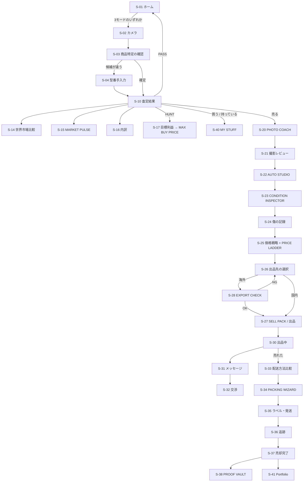

# 02. 画面構成・画面遷移

## 1. UX 原則

> アプリは専門家向け管理画面になってはいけない。

| 原則 | 具体的な形 |
|---|---|
| 中心は常にカメラ | どの画面からも 1 タップでスキャンに戻れる。タブバー中央は 📸 |
| 判断を先に、根拠は後に | 画面上部は **BUY / PASS / HOLD / SELL** と金額。内訳は「▼ 内訳を見る」で展開 |
| 数字は必ず出どころ付き | すべての金額行に、出典と取得日時を出せる（禁止事項 N-10） |
| 専門用語を使わない | 「Sell-through 68%」ではなく「**出ている 10 個のうち 7 個は売れている**」 |
| 断定しない | 予測は必ずレンジ + Confidence バッジ |

---

## 2. 画面一覧

### ホームとスキャン

| ID | 画面 | 役割 |
|---|---|---|
| S-01 | ホーム | 大きな 3 ボタン（NEW BUY / MY STUFF / HUNT）+ 中央カメラ。下に TODAY'S HUNT（V1） |
| S-02 | カメラ / SCAN | 撮影。バーコード自動検出。モード切替チップ |
| S-03 | 商品特定の確認 | 候補一覧 + 信頼度。「違う」で型番手入力へ |
| S-04 | 型番手入力 | 最後の逃げ道。ここが無いと詰む |

### 査定結果（3 モード共通の骨格 + モード別ヘッダ）

| ID | 画面 | 役割 |
|---|---|---|
| S-10 | 査定結果（共通） | VALUE RESULT の表示器。以下 3 つはヘッダと CTA だけが違う |
| S-11 | └ NEW BUY ヘッダ | TRUE COST、残存価値、Value Retention |
| S-12 | └ MY STUFF ヘッダ | 現在価値、購入額との差、SELL / HOLD |
| S-13 | └ HUNT ヘッダ | REAL NET PROFIT、BUY / RISKY / PASS、MAX BUY PRICE |
| S-14 | 世界市場比較 | 国別の実質利益ランキング、BEST MARKET、TREASURE SCORE（V1） |
| S-15 | MARKET PULSE | 出品数・実売数・販売速度・価格レンジ・トレンド・競合数 |
| S-16 | 内訳シート | 手数料・送料・梱包・税・為替・返品想定の全行と出典 |
| S-17 | 目標利益設定 | HUNT。目標利益 → MAX BUY PRICE の逆算 |

### 出品準備

| ID | 画面 | 役割 |
|---|---|---|
| S-20 | PHOTO COACH | カテゴリ別の必要ショット一覧。撮影済み／未撮影／要リテイク |
| S-21 | 撮影レビュー | ぼけ・暗さ・反射・見切れの指摘とリテイク |
| S-22 | AUTO STUDIO | 加工前後の比較。**加工は元に戻せる。原本は必ず残る** |
| S-23 | CONDITION INSPECTOR | 自動生成チェックリスト。AI が答えを埋めない |
| S-24 | 傷の記録 | AI が検出候補を提示 → ユーザーが確認 → アップ撮影 |
| S-25 | 価格戦略 | QUICK / BALANCED / MAX の 3 枚のカード + PRICE LADDER |
| S-26 | 出品先の選択 | 国 × Marketplace。API 連携済みは直接出品、未連携は SELL PACK |
| S-27 | SELL PACK | 生成されたタイトル・説明・状態・写真順。各項目をコピー |
| S-28 | EXPORT CHECK | 電池・危険物・電圧・リージョン・仕向国規制の確認結果 |

### 販売中〜完了

| ID | 画面 | 役割 |
|---|---|---|
| S-30 | 出品中一覧 | 状態別。閲覧数・ウォッチ数（取得できる場合） |
| S-31 | メッセージ | 原文 → 日本語 → 定型回答 → 送信前プレビュー |
| S-32 | 交渉（V1） | 最低価格に対する Accept / Counter / Decline 提案 |
| S-33 | 配送方法比較 | ECONOMY / STANDARD / EXPRESS。到着目安・追跡・保険・利益への影響 |
| S-34 | PACKING WIZARD | 資材リストと手順。梱包前後の写真撮影を促す |
| S-35 | ラベル・発送 | ラベル発行 / 手続きへの誘導。追跡番号の登録 |
| S-36 | 追跡（V1） | 配送状況、税関滞留、購入者への連絡文案 |
| S-37 | 売却完了 | REAL NET PROFIT の確定値と、査定時の予測との差分 |
| S-38 | PROOF VAULT | 取引ごとの証拠一式 |

### 資産・設定

| ID | 画面 | 役割 |
|---|---|---|
| S-40 | MY STUFF 一覧 | 所有物。現在価値の合計 |
| S-41 | Portfolio | 購入総額 vs 現在の再販価値。推移グラフ |
| S-42 | 商品詳細 | 1 商品の全履歴（査定・出品・メッセージ・発送） |
| S-43 | 設定 | アカウント、Marketplace 連携、配送元住所、通貨、通知 |
| S-44 | データと同意 | 実績データの匿名集計への提供可否、エクスポート、退会 |
| S-45 | 梱包材在庫（V1） | 箱・緩衝材の在庫 |

---

## 3. 主要な遷移



---

## 4. 3 モードが同じ画面を共有する理由

S-10 は**同じ VALUE RESULT を描く 1 つの画面**であり、
モード差はヘッダ（強調する数字）と CTA（次の行動）だけである。

| | 強調する数字 | 主 CTA | 副 CTA |
|---|---|---|---|
| NEW BUY | TRUE COST | 「買う」→ MY STUFF 登録 | 「やめる」 |
| MY STUFF | 現在価値 / 購入額との差 | 「売る」→ 出品準備 | 「持ち続ける」 |
| HUNT | REAL NET PROFIT / MAX BUY | 「買う」→ MY STUFF 登録 | 「PASS」 |

**この構造を崩さない。** モードごとに独自の結果画面を作り始めた瞬間、
価格ロジックがコピーされて 3 つに分岐する。設計上の一番の事故がここで起きる。

---

## 5. 数字の見せ方の規約

すべての金額表示は次の 3 要素を持つ。**例外を作らない。**

```
┌──────────────────────────────────────┐
│ 想定売却価格   ¥27,000 – ¥31,000     │  ← ① レンジ（単一値にしない）
│ 中央値 ¥29,800        [ 信頼度 中 ]  │  ← ② Confidence バッジ
│ ▼ 直近90日の実売 23件 / eBay US      │  ← ③ 根拠（件数・期間・出典）
└──────────────────────────────────────┘
```

- データ 5 件未満 → **中央値を出さない。レンジのみ。BUY 判定も出さない。**
- 24 時間より古いデータ → 「◯時間前の情報」を明示し Confidence を 1 段下げる。
- 送料が未取得 → 「¥—（未取得）」と表示。**推定値で埋めない**（禁止事項 N-7）。

### Confidence バッジ

| 表示 | 意味 | 判定に与える影響 |
|---|---|---|
| 高 | 十分な実売データ、直近、ばらつき小 | すべての判断を出してよい |
| 中 | データはあるが少ない／やや古い／ばらつき大 | BUY は出せる。TREASURE 判定は出さない |
| 低 | データ不足 | 「データ不足」と表示。**BUY / SELL の断定をしない** |

---

## 6. 画面ごとの禁止事項

| 画面 | してはいけないこと |
|---|---|
| S-03 | 信頼度が低いのに 1 候補だけ出して確定させる |
| S-22 | 加工後の写真だけを保持する（原本消失は証拠能力を失う） |
| S-23 | AI がチェック項目に初期値「済」を入れる |
| S-25 | 回転の遅い商品に MAX VALUE を推奨として出す |
| S-27 | 事実台帳にない語（美品・完動品・純正）を含む文を出す |
| S-28 | 判定不能を「発送可能」と表示する |
| S-31 | ユーザー確認前に自動送信する |
| S-33 | 見積が取れなかった配送方法を「概算」で並べる |

---

## 7. 初回オンボーディング（MVP）

海外販売の障壁を下げるのが目的なので、**最初に長い設定をさせない。**

1. できることを 3 画面で説明（撮る → 世界の価値がわかる → 売れる）
2. カメラ権限の要求（用途を先に説明してから）
3. **すぐスキャンさせる**（アカウント登録前に 1 回体験できる）
4. 保存・出品しようとした時点で初めてアカウント作成
5. 発送元の住所・通貨は、**実際に出品する直前**に聞く

`要確認`: 未登録での試用回数（3 回程度を想定）。API コストと直結するため、
[10](10-BACKLOG.md) EPIC-0 の原価計測後に決める。
