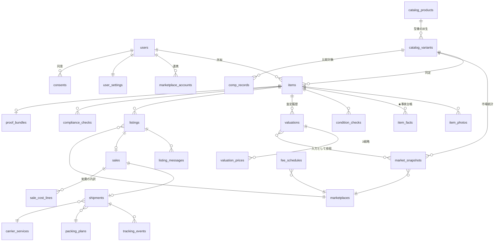

# 04. データモデル / ERD

## 1. 設計方針

| 方針 | 理由 |
|---|---|
| **カタログ（商品）と個体（ユーザーの物）を分ける** | 同じ型番でも状態も履歴も違う。市場データは型番に、写真と傷は個体に紐づく |
| **査定結果は入力ごと不変で保存する** | 「そのときなぜそう判断したか」を再現できる。予測精度の検証と紛争対応の両方に効く |
| **事実は台帳に一元化する（FACT LEDGER）** | 出品文・状態表示・証拠がすべて同じ事実を参照する。虚偽記載の入り口を1つに絞る |
| **手数料・税・規制はバージョン付きの参照データ** | コードに埋め込まない（禁止事項 N-6）。過去の取引は当時の版で再計算できる |
| **外部 API の生レスポンスを JSONB で残す** | 集計ロジックを後から変えても、再集計できる |
| **PII は専用テーブルに隔離** | 住所・氏名は最小限、別テーブル・別権限（[08](08-SECURITY-PRIVACY.md)） |

---

## 2. ER 図（中核）

---

## 3. テーブル定義

表記: `PK` 主キー / `FK` 外部キー / `NN` NOT NULL / `enum` は DB 側の列挙型

### 3.1 ユーザー

**users** — 認証は Supabase Auth に委譲し、アプリ側は最小限を持つ

| 列 | 型 | 備考 |
|---|---|---|
| id | uuid PK | Auth の user id と一致 |
| created_at | timestamptz NN | |
| country | text NN | 既定 `JP`。将来の多国展開の分岐点 |
| plan | enum NN | `free` / `pro` |
| deleted_at | timestamptz | 論理削除。物理削除はバッチ |

**user_settings**

| 列 | 型 | 備考 |
|---|---|---|
| user_id | uuid PK FK | |
| display_currency | text NN | 既定 `JPY` |
| target_profit_default | int | HUNT の目標利益の既定値 |
| fx_spread_bps | int NN | 為替コストの想定（既定 200 = 2.0%） |
| return_rate_override | numeric | 返品率の想定を上書きする場合 |
| notification_prefs | jsonb | |

**ship_from_addresses** — **PII 隔離テーブル**（[08](08-SECURITY-PRIVACY.md) §3）

| 列 | 型 | 備考 |
|---|---|---|
| id | uuid PK | |
| user_id | uuid FK NN | |
| encrypted_payload | bytea NN | 氏名・住所・電話をまとめて列レベル暗号化 |
| postal_code | text NN | 送料計算に必要なため平文で保持（粒度が粗い） |
| country | text NN | |

**marketplace_accounts** — OAuth トークンは**端末に置かない**

| 列 | 型 | 備考 |
|---|---|---|
| id | uuid PK | |
| user_id | uuid FK NN | |
| marketplace_id | text FK NN | |
| external_user_id | text | |
| encrypted_tokens | bytea | KMS で暗号化。アプリからは復号結果を返さない |
| scopes | text[] | |
| status | enum | `active` / `expired` / `revoked` |

**consents** — 同意は取得のたびに追記（取り消しも行として残す）

| 列 | 型 | 備考 |
|---|---|---|
| id | uuid PK | |
| user_id | uuid FK NN | |
| kind | enum NN | `tos` / `privacy` / `data_aggregation` / `marketing` |
| version | text NN | 規約のバージョン |
| granted | bool NN | 取り消しは `granted=false` の新行 |
| granted_at | timestamptz NN | |

---

### 3.2 カタログ（型番の世界）

**catalog_products**

| 列 | 型 | 備考 |
|---|---|---|
| id | uuid PK | |
| category_id | text FK NN | `camera.lens` など階層文字列 |
| brand | text NN | |
| model_name | text NN | |
| release_date | date | 残存価値の推定に使う（GT-F02） |
| msrp_jpy | int | 分かる場合のみ |
| source | enum NN | `catalog_api` / `user_submitted` / `admin` |

**catalog_variants** — 色・容量・仕向地違い。**市場データはここに紐づく**

| 列 | 型 | 備考 |
|---|---|---|
| id | uuid PK | |
| product_id | uuid FK NN | |
| gtin | text | JAN / UPC / EAN。**あれば最優先の同定キー** |
| mpn | text | 型番 |
| attributes | jsonb NN | `{"mount":"EF","color":"black","region":"JP"}` |
| weight_g | int | カタログ値。実測があれば item 側が優先 |
| dimensions_mm | int[3] | 同上 |
| has_battery | bool | EXPORT CHECK の入力 |
| voltage_spec | jsonb | `{"v":100,"hz":[50,60],"plug":"A"}` |

**categories** — PHOTO COACH のショット定義、チェックリスト、梱包規則をここに持たせる

| 列 | 型 | 備考 |
|---|---|---|
| id | text PK | |
| parent_id | text FK | |
| name_ja / name_en | text NN | |
| required_shots | jsonb NN | GT-F18 のショット定義 |
| condition_checklist | jsonb NN | GT-F24 の項目テンプレート |
| packing_rules | jsonb NN | GT-F36 |
| photo_order | text[] NN | GT-F28 |

---

### 3.3 個体（ユーザーの物の世界）

**items**

| 列 | 型 | 備考 |
|---|---|---|
| id | uuid PK | |
| user_id | uuid FK NN | |
| variant_id | uuid FK | 未同定の間は NULL を許す |
| mode | enum NN | `new_buy` / `my_stuff` / `hunt` |
| status | enum NN | [01](01-ARCHITECTURE.md) §6 の状態機械と一致 |
| identification | jsonb NN | 手段・信頼度・候補一覧を保存（GT-F59） |
| purchase_price_jpy | int | |
| purchase_date | date | |
| measured_weight_g | int | **実測はカタログ値より優先**（GT-F28 の前提） |
| measured_dims_mm | int[3] | |
| serial_number | text | 暗号化対象。表示は下4桁のみ |
| condition_grade | enum | 内部正規スケール `C1`〜`C6`（[07](07-VALUE-ENGINE.md) §3） |
| created_at | timestamptz NN | |

**item_photos**

| 列 | 型 | 備考 |
|---|---|---|
| id | uuid PK | |
| item_id | uuid FK NN | |
| role | enum NN | `main` / `front` / `back` / `serial` / `damage` / `accessory` / `packed_before` / `packed_after` |
| original_key | text NN | **原本。加工しない。消さない** |
| original_sha256 | text NN | 改変検知 |
| processed_key | text | AUTO STUDIO 後 |
| processing_ops | jsonb | 適用した処理の全ログ（GT-F21 の監査） |
| quality | jsonb | ぼけ・露出・見切れの判定結果 |
| ai_findings | jsonb | 検出候補（**確定事実ではない**） |
| is_proof | bool NN | PROOF VAULT 対象 |

**item_facts** — ★ FACT LEDGER。**出品文が参照できる唯一の事実源**

| 列 | 型 | 備考 |
|---|---|---|
| id | uuid PK | |
| item_id | uuid FK NN | |
| key | text NN | `power_on` / `has_box` / `scratch_lens_front` / `shutter_count` など |
| value | jsonb NN | |
| source | enum NN | `user_confirmed` / `barcode` / `ocr` / `catalog` / `image_model` / `marketplace_api` |
| verified | bool NN | **`image_model` 単独では常に false**。ユーザー確認で true |
| evidence_photo_id | uuid FK | 根拠写真 |
| created_at | timestamptz NN | |

> **制約**: 出品文の生成器は `verified = true` の事実のみを入力に取る。
> この 1 行が禁止事項 N-3（未確認の動作状態を書く）を構造的に防ぐ。

**condition_checks / condition_check_items**

| 列 | 型 | 備考 |
|---|---|---|
| id | uuid PK | |
| item_id | uuid FK NN | |
| template_version | text NN | カテゴリのチェックリスト版 |
| completed_at | timestamptz | 未完了なら出品に進めない |

| 列 | 型 | 備考 |
|---|---|---|
| check_id | uuid FK NN | |
| key | text NN | |
| answer | enum NN | `yes` / `no` / `unknown` / `not_applicable` |
| answered_by | enum NN | `user` / `system`（system は客観確定できる項目のみ） |
| fact_id | uuid FK | 回答から生成された事実 |

---

### 3.4 市場データ

**marketplaces**

| 列 | 型 | 備考 |
|---|---|---|
| id | text PK | `ebay_us` / `ebay_uk` / `ebay_de` / `mercari_jp` / `yahoo_auction_jp` |
| country | text NN | |
| currency | text NN | |
| capabilities | jsonb NN | `{"search":true,"stats":true,"list":false,"messages":false}` |
| data_permission | enum NN | `official_api` / `partner` / `public_licensed` / `user_input` / **`none`** |
| listing_spec | jsonb NN | 文字数制限・カテゴリ・必須項目（GT-F26） |

> `data_permission = none` の Marketplace からは**データを取得しない**。
> `capabilities.list = false` なら**出品 API を呼ばない**。禁止事項 N-4 / N-5 の実装点。

**comp_records** — 比較対象の 1 件（出品 or 実売）

| 列 | 型 | 備考 |
|---|---|---|
| id | uuid PK | |
| variant_id | uuid FK NN | |
| marketplace_id | text FK NN | |
| kind | enum NN | `active` / `sold` |
| price | numeric NN | 元通貨 |
| currency | text NN | |
| shipping_price | numeric | 送料込み価格の正規化に使う |
| condition_raw | text | 各サイトの状態表記 |
| condition_grade | enum | 内部正規スケールへ変換後 |
| observed_at | timestamptz NN | |
| sold_at | timestamptz | `kind=sold` のとき |
| raw | jsonb NN | 生レスポンス（再集計用） |
| source | enum NN | `official_api` / `user_input` / `own_sale` |
| retention_until | date | 規約上の保持期限。**期限で自動削除** |

**market_snapshots** — 集計済み。VALUE ENGINE の直接の入力

| 列 | 型 | 備考 |
|---|---|---|
| id | uuid PK | |
| variant_id | uuid FK NN | |
| marketplace_id | text FK NN | |
| condition_grade | enum NN | |
| window_days | int NN | 90 など |
| active_count / sold_count | int NN | |
| sold_p25 / p50 / p75 | numeric | **重み付き分位数**（[07](07-VALUE-ENGINE.md) §4） |
| active_p25 / p50 / p75 | numeric | |
| sell_through | numeric | |
| daily_sold_rate | numeric | 需要率 λ |
| trend_30d | numeric | 価格トレンド（%） |
| sample_size | int NN | Confidence の入力 |
| dispersion | numeric | 対数価格の MAD |
| computed_at | timestamptz NN | 鮮度 |
| method_version | text NN | 集計アルゴリズムの版 |

---

### 3.5 参照データ（バージョン付き）

**fee_schedules** / **carrier_services** / **fx_rates** / **tax_rules** / **compliance_rules**

| テーブル | 主な列 | 要点 |
|---|---|---|
| fee_schedules | marketplace_id, category_id, rate, fixed_fee, payment_fee, **valid_from / valid_to**, source_url | 過去取引は当時の版で再計算できる |
| carrier_services | carrier_id, service_code, tier(`economy`/`standard`/`express`), countries, has_tracking, has_insurance, max_weight_g, restrictions | 送料そのものは持たない（見積は都度取得） |
| fx_rates | base, quote, mid_rate, observed_at, source | mid のみ保持。スプレッドは設定値で別途加算 |
| tax_rules | country, kind(`vat`/`duty`/`import_fee`), rate, threshold, **valid_from**, source_url, **verified_at** | `verified_at` が古いと UI で警告（禁止事項 N-6） |
| compliance_rules | country, category_id, rule_kind, severity(`block`/`warn`), text_ja, source_url, verified_at | EXPORT CHECK の根拠 |

> すべての参照データに `source_url` と `verified_at` を必須にする。
> **出どころと確認日が言えないルールは、システムに入れない。**

---

### 3.6 査定

**valuations** — ★ 入力ごと不変保存

| 列 | 型 | 備考 |
|---|---|---|
| id | uuid PK | |
| item_id | uuid FK NN | |
| mode | enum NN | |
| engine_version | text NN | 計算ロジックの版 |
| **inputs** | jsonb NN | 市場スナップショット・手数料・送料見積・為替・状態を**丸ごと** |
| result | jsonb NN | VALUE RESULT 全体 |
| best_market | text | |
| confidence | enum NN | `high` / `medium` / `low` |
| computed_at | timestamptz NN | |

**valuation_prices** — 3 戦略（検索・比較のために正規化して持つ）

| 列 | 型 | 備考 |
|---|---|---|
| valuation_id | uuid FK NN | |
| strategy | enum NN | `quick` / `balanced` / `max` |
| marketplace_id | text NN | |
| price | numeric NN | |
| net_profit_jpy | numeric NN | |
| est_days_to_sell | numeric | |
| sellability | int | 0〜100 |
| recommended | bool NN | MAX VALUE 非推奨（GT-F14）はここが false |

---

### 3.7 出品・販売・発送

**listings**

| 列 | 型 | 備考 |
|---|---|---|
| id | uuid PK | |
| item_id / user_id / marketplace_id | FK NN | |
| method | enum NN | `api` / `sell_pack`（コピー方式） |
| external_id | text | API 出品時のみ |
| title / description | text | 生成結果 |
| **generation_fact_ids** | uuid[] NN | **この文が根拠にした事実の一覧**（監査可能に） |
| price / currency | numeric / text NN | |
| strategy | enum | どの戦略で出したか（後の精度検証に使う） |
| status | enum NN | `draft` / `active` / `sold` / `ended` |
| listed_at / ended_at | timestamptz | |

**listing_messages** — 購入者とのやり取り。**外部からの入力＝信用しない**

| 列 | 型 | 備考 |
|---|---|---|
| id | uuid PK | |
| listing_id | uuid FK NN | |
| direction | enum NN | `inbound` / `outbound` |
| original_text | text NN | 原文 |
| translated_ja | text | 日本語訳 |
| draft_text | text | AI 生成の返信案 |
| approved_by_user | bool NN | **false のまま送信することはない** |
| sent_at | timestamptz | |

**sales**

| 列 | 型 | 備考 |
|---|---|---|
| id | uuid PK | |
| listing_id | uuid FK NN | |
| sold_price / currency | numeric / text NN | |
| sold_at | timestamptz NN | |
| buyer_country | text | |
| time_to_sell_days | numeric | 予測との比較に使う |
| valuation_id | uuid FK | **出品時の査定** — 予測 vs 実績の検証キー |
| net_profit_jpy | numeric | 確定後に埋まる |

**sale_cost_lines** — 実費の内訳（予測ではなく実績）

| 列 | 型 | 備考 |
|---|---|---|
| sale_id | uuid FK NN | |
| kind | enum NN | `marketplace_fee` / `payment_fee` / `shipping_intl` / `shipping_domestic` / `packing` / `tax` / `fx` / `return` / `other` |
| amount_jpy | numeric NN | |
| source | enum NN | `actual` / `estimated` |

**shipments / tracking_events / packing_plans / packing_stock**

| テーブル | 主な列 |
|---|---|
| shipments | sale_id, carrier_service_id, quoted_amount, actual_amount, label_key, tracking_number, weight_g, dims_mm, shipped_at |
| tracking_events | shipment_id, occurred_at, status, location, raw |
| packing_plans | item_id, box_size, materials(jsonb), steps(jsonb), total_cost_jpy |
| packing_stock | user_id, material_key, quantity, low_threshold |

**compliance_checks** — EXPORT CHECK の結果（[09](09-LEGAL-CHECKLIST.md)）

| 列 | 型 | 備考 |
|---|---|---|
| item_id / country | FK / text NN | |
| result | enum NN | `ok` / `warn` / `block` / `unknown` |
| findings | jsonb NN | 該当ルールと根拠 URL |
| rules_version | text NN | |
| checked_at | timestamptz NN | |

> `result = unknown` は **`ok` として扱わない**（禁止事項 N-8）。UI では発送導線を止める。

**proof_bundles** — PROOF VAULT

| 列 | 型 | 備考 |
|---|---|---|
| id | uuid PK | |
| item_id / sale_id | FK | |
| manifest | jsonb NN | 含まれる写真・事実・チェック・発送情報の ID とハッシュ |
| bundle_sha256 | text NN | 束全体のハッシュ |
| sealed_at | timestamptz NN | **封をした後は追記のみ。書き換えない** |

---

## 4. 保持期間と削除

| データ | 保持 | 根拠 |
|---|---|---|
| 原本写真 | 取引完了 + 3 年 | 紛争対応。ユーザーは個別削除可能 |
| PROOF VAULT | 取引完了 + 3 年 | 同上 |
| `comp_records` | 各 API 規約の許す期限（`retention_until`） | 規約遵守。**期限バッチで自動削除** |
| `market_snapshots` | 無期限（集計値・個票ではない） | トレンド分析の資産 |
| 住所・氏名 | 発送完了 + 90 日 | 最小化 |
| 退会 | 30 日後に物理削除。集計済み匿名データは残る（同意時に明示） | [08](08-SECURITY-PRIVACY.md) §5 |

`要確認`: `comp_records` の保持可能期間は API 規約ごとに異なる。
[09](09-LEGAL-CHECKLIST.md) L-2 で確認するまで、**保持期限は 30 日の安全側**で実装する。
