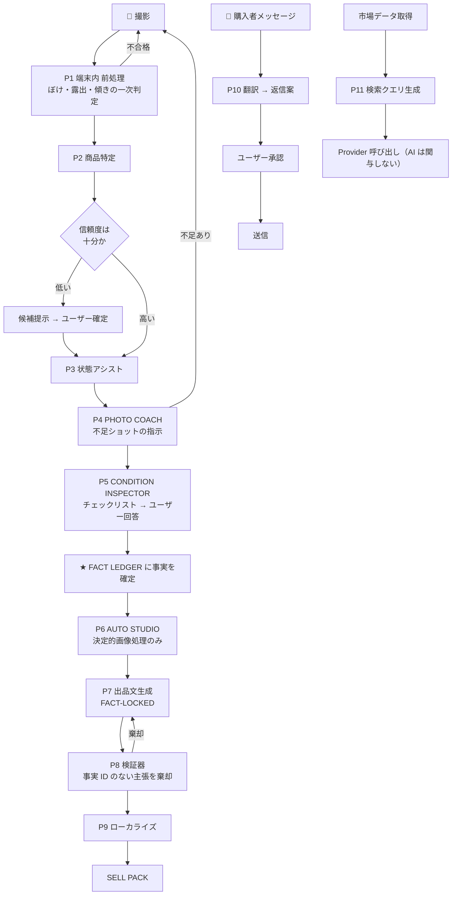
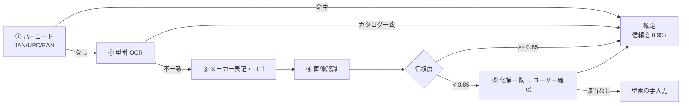

# 05. AI 処理パイプライン

## 1. AI に任せることと、任せないこと

依頼の第 47 節の原則を、**アーキテクチャで強制する**形に落とす。

| AI が担当する | AI に担当させない |
|---|---|
| 商品の候補を挙げる（確定はしない） | 価格・送料・手数料・税額の**数値** |
| 文字を読む（OCR） | 法規制・輸出可否の**判定** |
| 傷の**候補**を指摘する | 傷の**有無の確定** |
| 出品文の**文章化** | 出品文に書く**事実そのもの** |
| 翻訳・ローカライズ | Marketplace ルールの**内容** |
| 検索クエリの組み立て | 検索結果の**集計** |

### 強制の方法

LLM の出力を受け取る全経路に**スキーマを固定**する。
価格や重量を入れる欄が**そもそも存在しない**構造化出力しか受け付けない。

```ts
// 悪い例（絶対に作らない）
type ListingDraft = { title: string; description: string; suggestedPrice: number }
//                                                        ^^^^^^^^^^^^^^^^^^^^^^ 経路を与えた時点で負け

// 採用する形
type ListingDraft = {
  title: string
  description: string
  claims: Array<{ text: string; factIds: string[] }>   // 全主張に事実IDが必須
}
// 価格は VALUE ENGINE の出力を、生成後にテンプレートで差し込む
```

---

## 2. パイプライン全体



---

## 3. P1 — 端末内 前処理

サーバーに送る前に、**端末内で**明らかな失敗を弾く。通信量と AI コストの両方が減る。

| 判定 | 手法 | しきい値の扱い |
|---|---|---|
| ピンぼけ | ラプラシアン分散 | カテゴリ別に設定化 |
| 暗い / 白飛び | ヒストグラム | 同上 |
| 傾き | 端末のジャイロ + エッジ検出 | 撮影中に水平ガイドを出す |
| 商品の見切れ | オンデバイス物体検出 | 枠外にはみ出したら警告 |

**弾くのではなく、撮り直しを促す。** ユーザーを止めない。

---

## 4. P2 — 商品特定（GT-F59）

**画像だけで型番を断定しない。** 優先順位を実装順序として固定する。



| 手段 | 使う技術 | 信頼度の与え方 |
|---|---|---|
| ① バーコード | 端末内デコーダ | 0.98（読めた時点でほぼ確実） |
| ② 型番 OCR | OCR Provider + カタログ照合 | 文字列一致度と併せて 0.7〜0.95 |
| ③ メーカー表記 | OCR | 絞り込みにのみ使用 |
| ④ 画像認識 | Vision モデル | モデルの確信度をそのまま使わず、カタログ内候補への写像で再評価 |
| ⑤ ユーザー確認 | UI | 確定時 1.0 |

**信頼度は `items.identification` に手段ごと保存する。**
後から「画像認識だけで判断した査定」を洗い出して精度検証できるようにするため。

---

## 5. P3〜P5 — 状態の確定

ここが**アプリの信用の分かれ目**である。

### P3 状態アシスト（AI）

Vision モデルは**候補**だけを返す。返り値の型に「確定」という状態が存在しない。

```ts
type ConditionFinding = {
  kind: 'scratch' | 'dent' | 'dust' | 'fungus_suspect' | 'discoloration' | 'missing_part'
  location: string            // "前玉" "天面" など、カテゴリ辞書から選ぶ
  bbox: [number, number, number, number]
  confidence: number
  status: 'suspected'         // ★ この型に 'confirmed' は無い
}
```

確定は必ずユーザーの操作を経由し、`item_facts.verified = true` として台帳に入る。

### P4 PHOTO COACH（GT-F18）

カテゴリ定義（`categories.required_shots`）から不足ショットを算出する。AI の裁量ではない。

カメラの例:
```
正面 / 背面 / 上面 / 底面 / マウント / 型番 / 傷 / 付属品
```
ヘッドホンの例:
```
本体 / 左右イヤーパッド / ヘッドバンド / 端子 / ケース / 型番
```

P3 が傷を指摘したら、**その部位のアップ撮影ショットを動的に追加する**（GT-F22）。

### P5 CONDITION INSPECTOR（GT-F24）

- 項目はカテゴリのテンプレートから生成する
- **AI は初期値を埋めない。** 既定はすべて `unknown`
- 「電源が入る」「Bluetooth がつながる」など、**画像で判定できない項目は必ずユーザーに聞く**
- 未回答の項目は、出品文で「未確認」と書く。**書かないのではなく、未確認と書く**

---

## 6. P6 — AUTO STUDIO（GT-F20 / GT-F21）

> **雑な写真を、売れる写真へ。でも、嘘のない写真で。**

### 許可する処理（決定的・可逆）

背景除去（マスク合成）／白または自然背景への差し替え／明るさ・コントラスト調整／
ホワイトバランス／傾き補正／トリミング／余白調整／ノイズ低減（軽度）

### 禁止する処理（**実装しない。ライブラリも入れない**）

生成的な補完（inpainting / outpainting）／傷・汚れ・欠けの除去／
付属品の追加・合成／局所的なレタッチ／強いノイズ低減による質感の消失

### 守るための仕組み

| 仕組み | 内容 |
|---|---|
| 原本の不変保持 | `item_photos.original_key` は書き換えない。SHA-256 を保存 |
| 処理ログ | 適用した処理と引数を `processing_ops` に全件記録 |
| 差分検査 | 前景マスク内の**構造的差分**をしきい値で検査。超えたら加工を破棄 |
| 生成モデル不使用 | 画像処理経路に生成モデルの呼び出しを置かない（コードレビュー項目） |
| 証拠は無加工 | PROOF VAULT には**必ず原本**を入れる |

---

## 7. P7 / P8 — FACT-LOCKED GENERATION（GT-F27）

### 入力

```ts
type GenerationInput = {
  facts: Fact[]                    // verified === true のもののみ
  catalog: CatalogFacts            // メーカー公式情報
  marketplaceSpec: ListingSpec     // 文字数制限など（config-registry）
  locale: 'ja' | 'en'
  bannedUnlessVerified: string[]   // 下記の語彙リスト
}
```

### 生成後の検証器（P8）— ここが本体

生成そのものより、**機械的な検証**が主役である。

| 検査 | 内容 | 不合格時 |
|---|---|---|
| 事実 ID の裏付け | すべての `claim` に `factIds` があり、実在し、`verified=true` か | 該当文を削除して再生成 |
| 禁止語の検査 | 対応する事実がないのに「美品」「完動品」「純正」「新品同様」「動作確認済み」等を含む | 棄却 |
| 数値の突合 | 文中の数値が事実台帳または VALUE ENGINE の出力に存在するか | 棄却 |
| 未確認の明示 | `unknown` の項目が「未確認」として記載されているか | 追記 |
| 仕様適合 | 文字数・禁止文字・必須項目 | 切り詰めまたは再生成 |

2 回失敗したら、**テンプレート出力にフォールバックする**（事実を箇条書きにするだけの文）。
AI が書けないときに、嘘を書くくらいなら**素っ気ない文を出す**。

### 禁止語彙リスト（初期案・カテゴリ別に拡張）

| 語 | 必要な事実 |
|---|---|
| 美品 / 極上 | `condition_grade` が C3 以上 かつ 傷の事実が無い |
| 完動品 / 動作確認済み | 該当する動作チェック項目がすべて `yes` |
| 純正 | `is_genuine` が `user_confirmed` |
| 新品同様 | 使用回数の事実が存在する |
| 未使用 | `unused = true` が `user_confirmed` |

---

## 8. P9 — ローカライズ（GT-F29）

翻訳ではない。**販売国向けの作り直し**である。

| 要素 | 日本 | 米国 eBay の例 |
|---|---|---|
| タイトル | 型番中心 | ブランド + 型番 + 状態 + 主要属性（検索語順を国別に） |
| 状態表記 | 「目立った傷なし」 | eBay の Condition 定義に**写像**（勝手訳しない） |
| サイズ | mm / g | in / oz を併記 |
| 電圧 | 記載なしが普通 | **必ず明記**（100V, plug type A, 50/60Hz） |
| リージョン | 記載なし | DVD/BD リージョン、SIM 対応帯域、言語、保証範囲 |
| 注意書き | — | 変圧器が必要な旨、日本国内向け仕様である旨 |

電圧・リージョンの注記は**AI に書かせず、`catalog_variants.voltage_spec` から
テンプレートで機械的に挿入する**（GT-F43）。

---

## 9. P10 — SELLER ASSISTANT（GT-F31）

```
購入者の英文 → ① 原文保存 → ② 日本語訳 → ③ ユーザーが定型 or 自由文で回答
              → ④ 販売国向けの英文を生成 → ⑤ ユーザーが承認 → ⑥ 送信
```

**⑤ を飛ばす経路を作らない。** MVP では自動返信を一切実装しない。

定型回答: 在庫あり／値下げ／付属品／動作状態／Express 配送／発送予定／電圧／傷／返品

### 購入者メッセージは「攻撃されうる入力」である

購入者の文面に「これまでの指示を無視して…」といった文字列が含まれうる。
**外部からのテキストを LLM に渡す全経路で次を守る。**

| 対策 | 内容 |
|---|---|
| 役割の分離 | 購入者本文は必ず「翻訳・要約の対象データ」として渡す。指示として渡さない |
| 出力の制約 | 返信案は構造化出力。ツール呼び出し権限を持たせない |
| 数値の遮断 | 値下げ額・送料は**必ず VALUE ENGINE 由来**。本文中の数値をそのまま採用しない |
| 人間の関門 | 送信前にユーザー承認（上記⑤） |

---

## 10. P11 — 検索クエリ生成

LLM が作ってよいのは**検索語**まで。集計は Provider とサーバーが行う。

```
入力: brand=Canon, model=EF 50mm f/1.8 STM, category=camera.lens, market=ebay_us
出力: ["Canon EF 50mm f/1.8 STM", "Canon 50mm 1.8 STM lens", ...]  ← 文字列のみ
```

返ってきた件数や価格に AI は触れない。**触る経路が無い。**

---

## 11. AI Provider 抽象化（GT-F58）

```ts
interface VisionProvider {
  identifyProduct(images: ImageRef[], hints: IdentifyHints): Promise<ProductCandidate[]>
  findConditionIssues(images: ImageRef[], category: CategoryId): Promise<ConditionFinding[]>
  assessPhotoQuality(image: ImageRef): Promise<PhotoQuality>
}
interface OcrProvider  { readText(image: ImageRef, region?: Box): Promise<OcrResult> }
interface TextProvider {
  generateListing(input: GenerationInput): Promise<ListingDraft>
  translate(text: string, from: Locale, to: Locale): Promise<string>
  draftBuyerReply(input: ReplyInput): Promise<ReplyDraft>
  buildSearchQueries(input: QueryInput): Promise<string[]>
}
```

- 用途ごとに別インターフェースにする。**1 つの巨大な `askAI()` を作らない**
- 各実装は差し替え可能。1 ベンダー障害でアプリ全体が止まらない
- すべての呼び出しで **入力・出力・トークン数・費用・所要時間**を記録する
  （課金設計（GT-F60）は、この実測なしには不可能）

`要確認`: 初期採用するモデルは、実測（精度 × 原価 × 速度）で決める。
[10](10-BACKLOG.md) EPIC-0 で、カメラ 50 点の実写を使った比較を行う。

---

## 12. 失敗したときの挙動

| 失敗 | 挙動 |
|---|---|
| 商品を特定できない | 型番手入力へ誘導。**推測で確定しない** |
| Vision が応答しない | 状態チェックを手動のみで進められる |
| 出品文の生成が 2 回失敗 | 事実の箇条書きテンプレートを出す |
| 翻訳が失敗 | 原文を表示し、定型文で対応できるようにする |
| すべての AI が停止 | **査定機能は生きる**（VALUE ENGINE は AI に依存しない） |

最後の行が重要である。AI が止まってもアプリの中核価値は止まらない。
