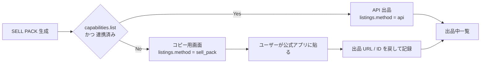

# 06. Integration Layer — 外部 API / Marketplace / 配送

## 1. 原則

| 原則 | 意味 |
|---|---|
| **ポートとアダプタ** | アプリの中心はインターフェースだけを知る。実装は外側 |
| **能力の宣言** | 各アダプタは「できること」を宣言する。できない機能は UI から消える |
| **できないことを埋めない** | 取得できない値は `null` を返す。**推定値で埋めない**（禁止事項 N-7） |
| **許諾状態をデータとして持つ** | `marketplaces.data_permission` が `none` なら取得コードが動かない |
| **生レスポンスを残す** | 集計方法を後から変えても再計算できる |

---

## 2. データ取得の優先順位（GT-F54）

依頼の第 43 節をそのまま実装ルールにする。

| 順位 | 取得元 | 実装上の扱い |
|---|---|---|
| 1 | Marketplace 公式 API | `data_permission = official_api` |
| 2 | 正式なパートナー契約 | `partner`。契約書の管理番号を運用台帳に記録 |
| 3 | 公開・利用許可されたデータ | `public_licensed`。ライセンス URL を必須 |
| 4 | ユーザー自身が入力した販売実績 | `user_input` |
| 5 | 本アプリ経由で成立した匿名化・集計済み実績 | `own_sale`（同意が前提） |

**上記以外からは取得しない。** スクレイパーをコードベースに置かない。

> 実装上の関門: `comp_records.source` は上記 5 種の列挙型のみ。
> それ以外の値を書く手段が存在しない。

---

## 3. MarketplaceProvider

```ts
interface MarketplaceProvider {
  readonly id: MarketplaceId
  readonly capabilities: MarketplaceCapabilities

  // 読み取り
  searchListings(q: SearchQuery): Promise<CompRecord[]>
  getMarketStats(q: StatsQuery): Promise<MarketStats | null>   // 取れなければ null

  // 書き込み（capabilities が許す場合のみ実装）
  createListing?(input: CreateListingInput): Promise<ExternalListing>
  updateListing?(id: string, patch: ListingPatch): Promise<void>
  endListing?(id: string): Promise<void>

  // メッセージ
  getMessages?(listingId: string): Promise<InboundMessage[]>
  sendReply?(listingId: string, body: string): Promise<void>
}

type MarketplaceCapabilities = {
  search: boolean
  soldData: boolean      // 実売データが取れるか（ここが取れないと精度が大きく落ちる）
  stats: boolean
  list: boolean
  messages: boolean
  fees: 'api' | 'table' | 'unknown'
}
```

### アダプタの計画

| アダプタ | 想定できること | MVP |
|---|---|---|
| `ebay_us` / `ebay_uk` / `ebay_de` | 検索・出品・メッセージ。実売データは**API の種類と審査次第** | ○（読み取り + 出品） |
| `manual_jp`（Mercari / ラクマ / ヤフオク 等） | **読み取りも書き込みも API を使わない**。SELL PACK 生成のみ | ○（SELL PACK） |
| `user_input` | ユーザーが手で入力した相場・実売 | ○ |
| その他 | 契約後に追加 | × |

> **国内 Marketplace の扱い（重要）**
> 公式に利用可能な出品 API が確認できない場合、
> **SELL PACK → コピー → 公式アプリで貼り付け**という方式に限定する。
> 自動化・非公式 API・スクレイピングは行わない（禁止事項 N-4 / N-5）。
> 国内の相場は当面 `user_input` と公開許諾データで補う。
> `要確認`: 各社の API 提供状況とデベロッパー規約 → [09](09-LEGAL-CHECKLIST.md) L-1

### 実売データが取れない場合の縮退

実売（sold）が取れず、出品中（active）しか取れない市場では:

- 価格は **active の分位数**から出す
- 「実売ベースではない」ことを UI に明示する
- **Confidence を 1 段下げる**
- Sell-through と販売速度は**出さない**（推定しない）

---

## 4. 出品の 2 方式



`sell_pack` 方式でも、**出品したことをアプリに記録させる**のが要点。
これがないと販売実績データ（GT-F55）が貯まらず、長期の競争優位が育たない。

---

## 5. ShippingProvider

```ts
interface ShippingProvider {
  readonly id: CarrierId
  readonly capabilities: ShippingCapabilities

  getRates(req: RateRequest): Promise<Rate[]>            // 見積が取れなければ空配列
  getTransitTimes(req: RateRequest): Promise<Transit[]>
  createShipment?(req: ShipmentRequest): Promise<Shipment>
  createLabel?(shipmentId: string): Promise<LabelRef>
  bookPickup?(req: PickupRequest): Promise<Pickup>
  cancelPickup?(pickupId: string): Promise<void>
  track?(trackingNumber: string): Promise<TrackingEvent[]>
  getLandedCost?(req: LandedCostRequest): Promise<LandedCost>
}

type Rate = {
  serviceCode: string
  tier: 'economy' | 'standard' | 'express'
  amount: Money
  transitDaysMin: number; transitDaysMax: number
  hasTracking: boolean
  hasInsurance: boolean
  insuranceLimit: Money | null
  restrictions: string[]        // 電池不可 など
  quotedAt: string              // 見積の取得時刻（鮮度の管理）
}
```

### 必ず 3 段で見せる（GT-F33）

ECONOMY / STANDARD / EXPRESS の 3 段は、
**配送会社の商品名ではなく `tier` で正規化して並べる。**
ユーザーは「安い・普通・速い」で理解し、会社名で理解しない。

### 見積が取れない場合

- **概算を出さない。**「未取得」と表示する（禁止事項 N-7）
- REAL NET PROFIT は「送料未確定のため利益は確定できません」と表示
- ただし、**過去の実績送料があればそれを参考値として明示的に区別して**出してよい

### 実測優先（GT-F39 の前提）

送料の入力となる重量・寸法は、**カタログ値より `items.measured_*` を優先**する。
カタログ値しかない場合は「概算（実測前）」と明示する。
**カメラ画像だけでサイズ・重量を断定しない。**

---

## 6. AIProvider

[05-AI-PIPELINE.md](05-AI-PIPELINE.md) §11 参照。

---

## 7. 参照データ Provider（為替 / 税 / 規制 / カタログ）

```ts
interface FxProvider     { getRate(base: string, quote: string, at?: Date): Promise<FxRate> }
interface TaxRuleProvider{ getRules(country: string, category: CategoryId): Promise<TaxRule[]> }
interface ComplianceProvider {
  check(input: ComplianceInput): Promise<ComplianceResult>   // ok / warn / block / unknown
}
interface CatalogProvider{ lookupByGtin(gtin: string): Promise<CatalogEntry | null> }
```

### 税・規制データの扱い（禁止事項 N-6）

| ルール | 実装 |
|---|---|
| コードに埋め込まない | すべて `tax_rules` / `compliance_rules` テーブル |
| 出典を持つ | `source_url` 必須 |
| 確認日を持つ | `verified_at` 必須。**90 日を超えたら UI に「要再確認」を出す** |
| 版で凍結 | 過去の取引は当時の `rules_version` で再現できる |
| 不明は不明 | 該当ルールが見つからないとき `unknown` を返す。**`ok` にしない** |

### 為替

- `mid_rate` を保存し、**スプレッドは `user_settings.fx_spread_bps` で加算**する
- 「なぜ手取りが目減りするか」を内訳で見せるため、為替コストは独立した費目にする
- レートの取得時刻を必ず表示する

---

## 8. 障害時の縮退（Degradation Matrix）

| 停止した外部 | アプリの挙動 |
|---|---|
| Marketplace の検索 API | キャッシュ済みスナップショットで表示 + 鮮度を明示 + Confidence を下げる |
| Marketplace の出品 API | SELL PACK 方式に自動フォールバック |
| 配送 API | 送料「未取得」。過去実績があれば参考値として表示 |
| Vision / OCR | 手入力で全工程を進められる |
| 為替 API | 直近取得レートを使い、取得時刻を明示 |
| 規制データ | `unknown` → **海外発送導線をブロック**（安全側に倒す） |

**唯一「安全側 = 止める」に倒すのは規制チェックだけ。** 他はすべて「明示して続行」。

---

## 9. レート制限・コスト・キャッシュ

| 対象 | 方針 |
|---|---|
| Marketplace 検索 | variant × marketplace × 状態 で 24 時間キャッシュ。同一商品の連続スキャンでは再取得しない |
| 配送見積 | 宛先国 × 重量帯 × 寸法帯 で 1 時間キャッシュ |
| 為替 | 1 時間キャッシュ |
| AI 呼び出し | 画像ハッシュで重複排除。同じ写真を 2 回解析しない |
| 全外部呼び出し | 呼び出し元ユーザー・用途・費用を記録。**1 スキャンあたりの原価**を常時把握 |

原価の把握は課金設計（GT-F60）の前提であり、
**MVP の最初から計測を入れる**（後付けは必ず漏れる）。

---

## 10. 秘匿情報

- 外部 API キーは**サーバーのみ**。端末に配布しない
- ユーザーの Marketplace トークンは KMS で暗号化し、**復号結果を API 応答に含めない**
- 連携解除でトークンを即時失効させる
- 詳細は [08-SECURITY-PRIVACY.md](08-SECURITY-PRIVACY.md)
