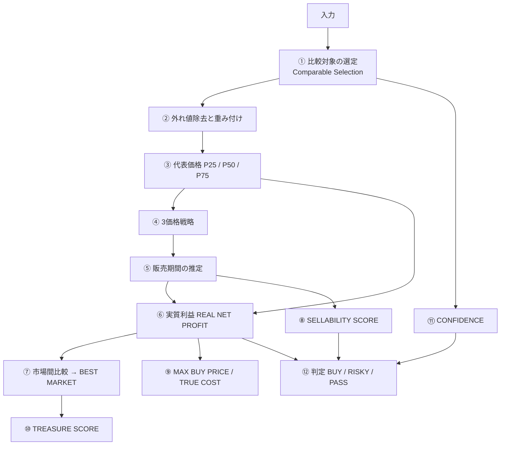

# 07. VALUE ENGINE — 市場価格・利益・スコアの算出ロジック

> このドキュメントが**プロダクトの心臓**である。
> ここに書かれた式以外の場所で、価格・利益・スコアを計算してはならない。

---

## 1. 入出力の型

```ts
type ValueInput = {
  now: Date                        // ★ 時刻すら引数。エンジンは I/O を持たない
  identity: { variantId: string; categoryId: string; attributes: Record<string, unknown> }
  condition: { grade: ConditionGrade; hasBox: boolean; accessories: string[]; issues: Issue[] }
  context:   { mode: 'new_buy'|'my_stuff'|'hunt'; purchasePriceJpy?: number; targetProfitJpy?: number }
  markets:   MarketCandidate[]     // 国 × Marketplace ごとに 1 件
  settings:  { fxSpreadBps: number; returnRateOverride?: number; displayCurrency: string }
}

type MarketCandidate = {
  marketplaceId: string
  country: string
  snapshot: MarketSnapshot | null      // 取れなければ null（推定しない）
  fees: FeeSchedule                    // バージョン付き
  shippingRates: Rate[]                // 取れなければ空配列
  fx: { midRate: number; observedAt: Date }
  taxes: TaxRule[]
  packingCostJpy: number
  compliance: 'ok'|'warn'|'block'|'unknown'
}

type ValueResult = {
  perMarket: MarketValuation[]
  bestMarket: { marketplaceId: string; reason: string } | null
  decision: 'BUY'|'RISKY'|'PASS'|'SELL'|'HOLD'|'INSUFFICIENT_DATA'
  trueCost?: MoneyRange                // NEW BUY
  maxBuyPrice?: MoneyRange             // HUNT
  scenarios?: { best: Money; expected: Money; worst: Money }
  treasureScore?: { score: number; components: ScoreComponent[] }
  confidence: 'high'|'medium'|'low'
  basis: Basis                         // ★ すべての結果に根拠が付く
}

type Basis = {
  sampleSize: number
  windowDays: number
  freshnessHours: number
  fallbackSteps: string[]              // どこまで条件を緩めたか
  missing: string[]                    // 取得できなかった費目
  engineVersion: string
}
```

**`confidence` と `basis` は省略可能なフィールドではない。**
型で必須にすることで、禁止事項 N-9（根拠なしの予測）を構文レベルで防ぐ。

---

## 2. 全体の流れ



---

## 3. 状態グレードの正規化

各 Marketplace の状態表記はバラバラなので、**内部正規スケール**に写像してから比較する。

| 内部 | 意味 | 係数 α（P50 に対する倍率の初期値） |
|---|---|---|
| C1 | 新品・未開封 | 1.25 |
| C2 | 新品同様・未使用 | 1.12 |
| C3 | 目立った傷や汚れなし | 1.00（基準） |
| C4 | やや傷や汚れあり | 0.88 |
| C5 | 傷や汚れあり | 0.72 |
| C6 | 全体的に状態が悪い / ジャンク | 0.45 |

- α は**初期値であり、データが貯まったら実測から更新する**（`method_version` で管理）
- 写像表は Marketplace ごとに `config-registry` に持つ。**コードに埋め込まない**
- **同一グレードの比較対象が十分にあるときは α を使わない**（実データが常に優先）

---

## 4. 比較対象の選定と代表価格

### 4.1 選定の初期条件（T0）

```
variant_id 一致
AND condition_grade ∈ {対象, 対象±1}
AND marketplace = 対象市場
AND kind = 'sold'
AND observed_at >= now - 90日
```

### 4.2 外れ値除去

価格の**対数**をとり、中央値絶対偏差（MAD）で判定する。

```
x_i  = ln(price_i)
med  = median(x)
MAD  = median(|x_i - med|)
σ̂    = 1.4826 * MAD
除外: |x_i - med| > 3σ̂
```

対数を使う理由: 中古価格は下に有界で右に裾が長い分布になりやすく、
そのまま平均を取ると高値の外れ値に引っ張られるため。

### 4.3 重み付け

```
w_i = recency_i × similarity_i

recency_i    = 0.5 ^ (age_days_i / 30)          … 半減期 30 日
similarity_i = 状態一致 1.0 / ±1グレード 0.6
             × 付属品一致 1.0 / 不一致 0.85
             × 同一 variant 1.0 / 近縁 variant 0.7
```

### 4.4 代表価格

重み付き分位数を用いる。

```
P25 = weightedQuantile(price, w, 0.25)
P50 = weightedQuantile(price, w, 0.50)
P75 = weightedQuantile(price, w, 0.75)
```

**送料込み価格に正規化する。** 「本体 1 円 + 送料 3,000 円」を混ぜて集計しないため。

### 4.5 データが足りないときの緩和手順（Fallback Ladder）

**1 段緩めるごとに Confidence を 1 段下げる。** 手順は固定し、順序を変えない。

| 段 | 緩和内容 | 有効サンプル数の目安 |
|---|---|---|
| 0 | T0 のまま | n ≥ 12 で理想 |
| 1 | 期間を 180 日に拡大 | |
| 2 | 状態を ±2 グレードに拡大（α で補正） | |
| 3 | 同一 product の別 variant を含める（similarity 0.7） | |
| 4 | 出品中（active）データを併用（**実売ではない旨を明示**） | |
| — | それでも n < 5 | **打ち切り。中央値を出さない** |

### 4.6 n < 5 のときの挙動

- 価格は**レンジのみ**（最小〜最大）
- `decision = 'INSUFFICIENT_DATA'`
- **BUY / SELL の断定を出さない**
- UI は「データが足りません。判断材料が揃っていません」と表示する

---

## 5. 3 価格戦略（GT-F13）

| 戦略 | 基準価格 | 意図 |
|---|---|---|
| ⚡ QUICK SALE | `min(P25, 最安の出品中価格 × 0.97)` | 競合より前に出て早期現金化 |
| ⚖️ BALANCED | `P50` | 価格と速度の釣り合い。**既定の推奨** |
| 💰 MAX VALUE | `P75` | 高値成約を狙う |

いずれも状態係数 α と付属品補正を掛けた後、Marketplace の価格刻みに丸める。

### MAX VALUE 非推奨判定（GT-F14）

次のいずれかで `recommended = false` とし、理由を表示する。

```
sell_through < 0.25                    → 「そもそも売れにくい市場です」
est_days_to_sell(P75) > 90             → 「3か月以上かかる見込みです」
active_count / max(sold_count,1) > 8   → 「出品が多すぎます」
```

---

## 6. 販売期間の推定（GT-F15 / PRICE LADDER）

**待ち行列的な考え方**を採る。説明できることを最優先した。

```
λ    = daily_sold_rate                          … 1日あたりの成約件数
rank = #{ 出品中の比較対象 | 価格 ≤ 自分の価格 } … 自分より安い競合の数
est_days_to_sell(p) ≈ (rank(p) + 1) / λ
```

> **考え方**: 自分より安い出品が売れていかないと自分の番は来ない、という近似。
> ユーザーへの説明は「あなたより安い出品が **7 件**あります。
> この市場は **1 日 0.4 件**売れているので、目安 **20 日**です」となり、
> 数式を見せずに根拠を伝えられる。

### 制約と補正

| 事項 | 扱い |
|---|---|
| λ = 0（実売なし） | 期間を出さない。「実績が無く見通せません」と表示 |
| 上限 | 180 日で打ち切り、「180 日以上」と表示 |
| 状態差 | rank の判定時に α で価格を正規化してから比較 |
| active が取れない市場 | 期間推定を**行わない**（[06](06-INTEGRATIONS.md) §3 の縮退） |

PRICE LADDER はこの関数を端末内で毎フレーム呼ぶだけなので、通信は発生しない。

---

## 7. REAL NET PROFIT（GT-F08）

```
NET(p) = p
       − marketplace_fee(p, category, marketplace)
       − payment_fee(p)
       − promotion_fee(p)              … 使う場合のみ
       − shipping_international        … 売主負担分。購入者負担なら 0（ただし表示はする）
       − shipping_domestic             … 集荷・持込・国内区間
       − packing_cost                  … PACKING WIZARD の資材合計
       − seller_borne_tax              … DDP を選んだ場合の関税・輸入税
       − fx_cost                       … 下記
       − expected_return_cost          … 下記
       − other_costs
```

### 為替コスト

```
fx_cost = p_in_foreign_currency × mid_rate × (fx_spread_bps / 10000)
```
既定 200 bps（2.0%）。**内訳に独立した行として必ず出す。**
「なぜ手取りが少ないのか」の最大の misunderstanding がここだから。

### 返品想定コスト

```
expected_return_cost = P(return) × (往復送料 + 返金されない手数料 + 再出品コスト)
```
`P(return)` はカテゴリ × 仕向国の実績から。**実績がない間は 0 とし、
「返品リスクは織り込んでいません」と明示する**（推測値を入れない）。

### 取得できなかった費目の扱い

`Basis.missing` に列挙し、UI では

```
実質利益  ¥12,400  （送料未取得のため確定値ではありません）
```

のように**確定値と呼ばない**。すべての費目が揃ったときだけ「実質利益」と言い切る。

---

## 8. 市場間比較と BEST MARKET（GT-F07）

すべての市場の NET を**表示通貨（既定 JPY）に換算**して並べる。

```
rank by NET_jpy(P50戦略) DESC
除外: compliance ∈ {'block'} の市場
警告: compliance = 'unknown' の市場は候補から外し「確認が必要」と表示
```

BEST MARKET には**理由を必ず付ける**。

> 🇸🇦 サウジアラビア — 実質利益 ¥24,600（日本比 +¥18,200）
> 理由: 実売価格が高い（+62%）／競合が少ない（3件）／送料差は ¥2,100

---

## 9. CONFIDENCE（GT-F53）

| 判定 | 条件（すべて満たす） |
|---|---|
| **high** | 有効サンプル n ≥ 12 / 緩和ステップ 0 / 鮮度 24h 以内 / 対数価格の MAD ≤ 0.25 / 実売データあり |
| **medium** | n ≥ 5 / 緩和ステップ ≤ 2 / 鮮度 72h 以内 |
| **low** | 上記以外（n < 5 は `INSUFFICIENT_DATA`） |

**Confidence が判定に与える制限**

| Confidence | できること |
|---|---|
| high | すべての判定・TREASURE 表示 |
| medium | BUY / SELL 判定は可。**🚨 TREASURE 表示は不可** |
| low | 「参考値」表示のみ。**BUY / SELL の断定を出さない** |

---

## 10. SELLABILITY SCORE（GT-F52）

**説明可能であることが要件**なので、加重和にする。ブラックボックスにしない。

```
score = Σ (w_k × c_k)      ただし c_k ∈ [0,100]
```

| k | 要素 c_k | 計算 | w_k |
|---|---|---|---|
| 1 | 需要 | `min(100, λ × 100 / λ_ref)`（λ_ref はカテゴリ基準） | 0.25 |
| 2 | 価格ポジション | 自分の価格の分位からの写像（安いほど高得点） | 0.25 |
| 3 | Sell-through | `sell_through × 100` | 0.20 |
| 4 | 競合 | `100 × (1 − rank / max(active_count,1))` | 0.15 |
| 5 | 状態 | C1:100 C2:92 C3:85 C4:70 C5:50 C6:25 | 0.10 |
| 6 | トレンド | 30日価格トレンドを 0〜100 に写像 | 0.05 |

UI では**寄与度を分解して見せる**。

```
売れやすさ 76
  需要         ██████████░░  22 / 25
  価格の位置   ████████░░░░  18 / 25
  売れ行き     ███████░░░░░  14 / 20
  競合の少なさ ████████░░░░  12 / 15
  状態         ███████░░░░░   8 / 10
  トレンド     ██░░░░░░░░░░   2 / 5
```

重みは `method_version` で管理し、実績データが貯まったら**回帰で更新する**
（ただし更新後も加重和の形を維持する。説明可能性を捨てない）。

---

## 11. MAX BUY PRICE（GT-F16）

目標利益から逆算する。

```
MAX_BUY = NET(p_expected) − target_profit − acquisition_costs
```

- `p_expected` は BALANCED 戦略価格（P50 ベース）
- `acquisition_costs` は仕入れ時の交通費等（設定で任意）
- 結果は**レンジで出す**: `NET(P25)` 基準（保守的）〜 `NET(P50)` 基準

> 目標利益 ¥5,000 のとき
> **上限仕入れ価格 ¥17,200 〜 ¥19,800**
> （安全に行くなら ¥17,200 以下）

---

## 12. BEST / EXPECTED / WORST（GT-F17）

| シナリオ | 売却価格 | 追加の前提 |
|---|---|---|
| BEST | P75 | 早期に成約、返品なし |
| EXPECTED | P50 | 推定期間で成約、返品率は実績値 |
| WORST | P25 × (1 − 想定値下がり) | 期間超過による値下げ + 返品発生 |

`想定値下がり` は、`trend_30d` が負のときに `est_days_to_sell` 分だけ外挿する。
**トレンドデータが無ければ WORST を出さず、「見通せません」と表示する。**

---

## 13. TRUE COST（GT-F01）

```
TRUE_COST = 購入価格 − 推定将来売却額の NET
```

MVP では「将来」を**現時点の中古相場**で代用し、そう明示する。

> 購入価格 ¥100,000
> いま中古で売った場合の手取り推定 ¥70,000（レンジ ¥66,000〜¥74,000）
> **実質コスト ≈ ¥30,000**
> ※ 将来価格の予測ではありません。現在の中古相場に基づく試算です。

時系列データが貯まった段階で、GT-F02（1年後・2年後の残存価値）に発展させる。
**データが無いうちに「1年後 ¥60,000」と出してはいけない。**

---

## 14. TREASURE SCORE（GT-F09 / V1）

```
raw = 0.30 × 価格差倍率スコア
    + 0.25 × 実質利益額スコア
    + 0.15 × 利益率スコア
    + 0.15 × 販売速度スコア
    + 0.10 × 供給差スコア
    − 0.10 × 配送難易度ペナルティ
    − 0.15 × 規制リスクペナルティ

score = clamp(round(raw × 100), 0, 100) × confidence_multiplier
confidence_multiplier: high 1.0 / medium 0.8 / low 0.0
```

**🚨 GLOBAL TREASURE FOUND を出す条件（すべて満たす）**

```
score ≥ 75  AND  confidence = 'high'  AND  compliance = 'ok'  AND  NET ≥ ¥5,000
```

Confidence が high でなければ、どれだけ価格差が大きくても 🚨 を出さない。
**薄いデータで「お宝」と叫ぶのが、このプロダクトが最も避けるべき失敗である。**

---

## 15. 判定（decision）

| 判定 | 条件 |
|---|---|
| BUY | NET ≥ 目標利益 かつ sellability ≥ 55 かつ confidence ≠ low かつ compliance = ok |
| RISKY | NET は出るが、sellability < 55 または WORST が赤字 または compliance = warn |
| PASS | NET < 0（EXPECTED 基準） |
| INSUFFICIENT_DATA | n < 5 または confidence = low |
| SELL（MY STUFF） | 現在価値がピーク圏 かつ 売れやすさが高い |
| HOLD（MY STUFF） | トレンドが上向き または 売れにくい時期 |

**判定にはすべて 1 行の理由を付ける。** 理由が書けない判定は出さない。

---

## 16. テスト方針

`value-engine` は外部依存ゼロなので、**全面的にテーブルテストで固める。**

| 種別 | 内容 |
|---|---|
| ゴールデンテスト | 実データ 50 件の入力 → 期待出力を固定。式を変えたら差分が出る |
| 境界テスト | n = 4/5/12、λ = 0、送料未取得、compliance = unknown |
| 不変条件 | 「価格を上げたら est_days は減らない」「NET は価格に単調増加」 |
| 通貨 | 丸め誤差。整数最小単位で計算し、表示時のみ丸める |
| 精度検証 | `sales` の実績 vs 出品時 `valuation` の予測を継続的に突き合わせる |

最後の行が長期的に最重要である。
**予測を出すプロダクトは、予測の外れ方を計測しない限り改善できない。**
