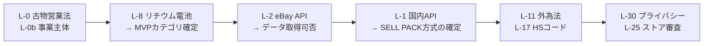

# 09. 事前確認が必要な事項（API 規約・法規制・輸出）

> **このドキュメントは法的助言ではない。**
> 「開発に着手する前に、一次情報または専門家に確認すべき論点」の一覧である。
> 本設計書の原則（第 29 節）どおり、**生成AIの記憶で法規制を判定しない**。
> 各項目には「どこで確認するか」を書いてあるので、確認結果をこの表に追記して運用する。
>
> 表記: **確認者** / **期限** / **結果** の 3 列は、確認作業を進めながら埋めること。

---

## 1. 最優先 — 事業として成立するかに関わる 3 件

### L-0. 古物営業法（HUNT モードの前提）

**これが最も重要な論点である。**

| 論点 | 内容 |
|---|---|
| 何が問題か | 中古品を**転売目的で継続的に買い取る**行為は、日本では古物営業の許可（古物商許可）を要する場合がある |
| 誰に関わるか | HUNT モードを使うユーザー本人。および、アプリ提供者が「その行為を助長する事業者」としてどう位置づけられるか |
| 影響 | HUNT モードの提供方法、利用規約の記載、ユーザーへの告知、場合によっては**許可証の登録を利用条件にするか**の判断 |
| 確認先 | 都道府県公安委員会 / 警察署の生活安全課、および弁護士 |
| 設計への織り込み | 設定画面に古物商許可番号の登録欄を用意し、HUNT モード初回利用時に**注意喚起を出す**設計にしておく（義務化するかは確認後に決定） |

> **設計判断**: 確認が済むまで、HUNT モードには
> 「継続的な転売には古物商許可が必要な場合があります」という告知を必ず表示する。
> 告知を出すことに法的リスクはないが、出さないことにはある。

### L-0b. 事業主体の決定（D-5）

個人・屋号・法人のいずれか。次のすべてがこれに依存する。

- 古物商許可の申請主体
- Marketplace API の開発者登録
- App Store / Google Play の開発者アカウント
- 特定商取引法に基づく表記
- 配送会社との契約
- プライバシーポリシーの事業者名

### L-0c. ユーザーの税務

アプリが「利益」を表示する以上、次を利用規約と FAQ で扱う必要がある。

| 論点 | 確認先 |
|---|---|
| 継続的な転売益の所得区分（雑所得 / 事業所得） | 税理士・国税庁の公表資料 |
| 輸出取引と消費税（輸出免税の要否・記録） | 同上 |
| インボイス制度との関係 | 同上 |
| アプリが提供してよい情報の範囲（税務相談にならない線引き） | 税理士 |

**設計への織り込み**: 売却実績の CSV エクスポート機能を用意する（確定申告の材料になる）。
ただし**税額の計算はしない**。税務相談に踏み込まない。

---

## 2. Marketplace API・データ利用規約

各項目について「①提供の有無 ②利用条件 ③データ保持の可否と期間 ④審査の要否と期間 ⑤商用利用の可否」を確認する。

| ID | 対象 | 確認する内容 | 確認先 |
|---|---|---|---|
| L-1 | 国内フリマ・オークション各社 | **公式の出品 API / 検索 API の提供有無**。提供がなければ SELL PACK 方式に確定 | 各社のデベロッパー向けサイト、規約、問い合わせ窓口 |
| L-2 | eBay | 利用可能な API の種類、**実売データの取得可否と審査要件**、データ保持期間、レート制限、商用利用条件 | eBay Developers Program の規約 |
| L-3 | 共通 | **取得データの保存可否と保持期間**（`comp_records.retention_until` の設定根拠） | 各 API 規約 |
| L-4 | 共通 | 取得データを**集計して自社データとして保持**してよいか | 各 API 規約 |
| L-5 | 共通 | 出品の自動化に関する制限（1 商品を複数サイトに同時出品する行為の可否を含む） | 各社の禁止事項 |
| L-6 | 共通 | ロゴ・ブランド名の表示条件 | 各社のブランドガイドライン |
| L-7 | 商品カタログ | GTIN / 型番のカタログデータをどこから得るか、その利用条件 | 候補サービスの規約 |

> **L-3 が決まるまでの実装方針**: 保持期間は **30 日**（安全側）で実装し、
> 確認後に `retention_until` の算出ルールを変更する。

> **してはいけないこと（再掲）**: 規約で許諾されていないデータ取得、
> robots.txt を無視した収集、非公開 API の利用、UI 自動操作による取得。
> **これらはコードベースに存在させない。**

---

## 3. 輸出・発送に関する規制（EXPORT CHECK の根拠）

| ID | 論点 | なぜ重要か | 確認先 |
|---|---|---|---|
| L-8 | **リチウム電池** | カメラ・PC・ヘッドホンのほぼ全てに関わる。輸送手段ごとに個数・容量・梱包・表示の要件がある。**MVP の対象カテゴリ選定に直結** | 各配送会社の危険物ガイド、IATA の規則、日本郵便の引受条件 |
| L-9 | 郵便・宅配便の**引受禁止品** | 会社ごとに違う。「送れないものを送れると言わない」（禁止事項 N-8） | 各社の禁制品一覧 |
| L-10 | 仕向国ごとの**輸入禁止・制限品** | 国ごとに大きく異なる。中古品の輸入規制がある国もある | 各国税関、日本郵便の国別条件、JETRO |
| L-11 | **外国為替及び外国貿易法**（該非判定） | 高性能な光学機器・電子機器は規制対象になりうる。**カメラを扱うなら必ず確認** | 経済産業省、CISTEC |
| L-12 | ワシントン条約（象牙・べっ甲・革製品等） | 中古品では現実に発生する | 経済産業省 |
| L-13 | 文化財保護法 | 古い品を扱う場合 | 文化庁 |
| L-14 | 電波法・仕向国の電波認証 | Bluetooth 機器等。日本の技適だけでは現地で使えない旨の記載が要る | 総務省、各国制度 |
| L-15 | 医薬品・化粧品・食品 | 対象カテゴリに入れないなら不要。**MVP では対象外と明示** | — |
| L-16 | 銃刀法・模造品 | モデルガン、ナイフ等 | 警察庁 |
| L-17 | HS コードと関税分類 | 誤申告は差止・追徴の原因。**AI に確定させない**（GT-F41） | 税関、関税率表 |
| L-18 | 各国の輸入税・VAT の徴収方式 | Marketplace が代理徴収する場合としない場合がある。LANDED COST の前提 | 各国制度、Marketplace の案内 |
| L-19 | 輸出時の消費税の扱い | 記録・証憑の要件 | 税理士、国税庁 |

### 設計への織り込み

```
compliance_rules に登録できるのは、source_url と verified_at を持つルールのみ。
該当ルールが無い場合の結果は 'unknown' であり、'ok' にはならない。
'unknown' の間、海外発送導線はブロックされる。
```

**L-8 の結果次第で MVP のカテゴリが変わる。** 最初に確認すべき技術的論点である。

---

## 4. 配送会社との関係

| ID | 論点 | 確認先 |
|---|---|---|
| L-20 | 料金・追跡・ラベル発行 API の提供有無と契約条件 | 各社の法人向け窓口 |
| L-21 | 個人ユーザーが本アプリ経由でラベルを発行できるか（契約主体は誰か） | 同上 |
| L-22 | 集荷 API（GT-F35）の提供有無 | 同上 |
| L-23 | 料金表示の条件（割引運賃を表示してよいか） | 同上 |
| L-24 | 保険・補償の範囲と、アプリでの説明義務 | 同上 |

`要確認`: MVP では、**ラベル発行はユーザー自身が公式手段で行い、
アプリは追跡番号を受け取るだけ**という最小構成から始めるのが安全。

---

## 5. アプリ配布・課金・表示

| ID | 論点 | 確認先 |
|---|---|---|
| L-25 | App Store / Google Play の審査基準（外部購入への誘導、サブスクリプションの扱い） | 各ストアのガイドライン |
| L-26 | 景品表示法（「必ず儲かる」等の表現の禁止） | 消費者庁 |
| L-27 | アフィリエイト（GT-F37）の表示義務（ステルスマーケティング規制） | 消費者庁、各 EC の規約 |
| L-28 | 為替レートの表示に関する注意（参考値である旨） | — |
| L-29 | 「査定」「鑑定」という語の使用に制約がないか | 弁護士 |

> **L-26 は UI 文言に直結する。** 「儲かる」「必ず」「保証」を使わない。
> TREASURE SCORE のような煽る表現にも、必ず「推定・参考値」の但し書きを付ける。

---

## 6. 個人情報・プライバシー

| ID | 論点 | 確認先 |
|---|---|---|
| L-30 | プライバシーポリシーの記載事項（取得・目的・第三者提供・保存期間） | 個人情報保護委員会のガイドライン |
| L-31 | **越境移転**（AI ベンダー・クラウドの所在国）の開示 | 同上 |
| L-32 | 匿名加工情報として扱う場合の要件（GT-F55 の集計） | 同上 |
| L-33 | 海外ユーザーの個人情報を扱う場合の各国法（GDPR 等） | 弁護士 |
| L-34 | 未成年の利用可否 | 弁護士 |

---

## 7. 確認の進め方（推奨順序）



**A と B が終わるまで、本格的な実装に入らない。**
この 2 つの結果次第で、対象カテゴリとモード構成が変わりうるためである。

`要確認`（全体）: 上記のうち、弁護士・税理士の確認が必要な項目については、
**確認結果とその日付を本ドキュメントに追記し、`compliance_rules` の
`verified_at` と一致させる**運用にする。
