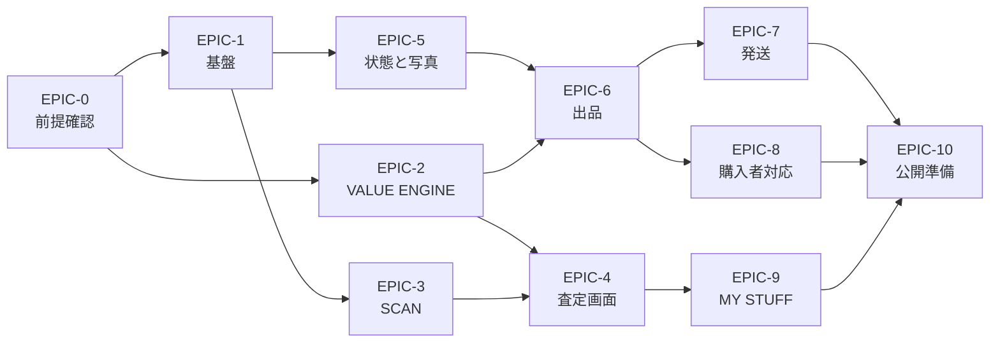

# 10. MVP 開発バックログ

## 1. 進め方

| 事項 | 方針 |
|---|---|
| 単位 | エピック → ストーリー。各ストーリーに**受入条件**を必ず付ける |
| 見積 | `pt` = 相対規模。1pt ≒ 慣れた開発者 1 人日 |
| 順序 | 上から順。ただし EPIC-0 の結果で下流が変わりうる |
| 完了の定義 | コード + テスト + 手動確認 + ドキュメント更新。**テストのないマージをしない** |
| 例外 | `value-engine` は**テストファースト**。式を先に固定してから実装する |

合計見積: **約 118pt**（1 人開発なら 5〜6 か月、2 人なら 3 か月程度が目安）

---

## EPIC-0. 前提確認とスパイク（12pt）— **ここから始める**

実装ではなく「調べる」フェーズ。**ここを飛ばすと後で作り直しになる。**

| # | ストーリー | 受入条件 | pt |
|---|---|---|---|
| 0-1 | 法務確認の最優先 3 件を実施 | [09](09-LEGAL-CHECKLIST.md) の L-0 / L-0b / L-8 に結果と日付が記入されている | 3 |
| 0-2 | Marketplace API のスパイク | eBay の検索・実売データを実際に取得し、**カメラ 20 型番分のサンプルを保存**。取得可否・件数・レート制限を記録 | 3 |
| 0-3 | 国内相場データの入手手段を確定 | 公式 API の有無を確認し、`user_input` 方式で行くかを決定。[06](06-INTEGRATIONS.md) §3 に反映 | 2 |
| 0-4 | AI モデルの比較 | 実写 50 点で商品特定の正解率・傷検出の再現率・**1 スキャンあたりの原価**を計測。表にまとめる | 3 |
| 0-5 | 対象カテゴリの最終決定 | 0-1〜0-4 の結果から MVP カテゴリを 1 つ確定し、[03](03-SCOPE-MVP.md) を更新 | 1 |

> **ゲート**: 0-5 が終わるまで EPIC-2 以降に着手しない。

---

## EPIC-1. 基盤（14pt）

| # | ストーリー | 受入条件 | pt |
|---|---|---|---|
| 1-1 | モノレポの構築 | [01](01-ARCHITECTURE.md) §3 の構成。`value-engine` が他パッケージに依存しないことを CI が検査する | 3 |
| 1-2 | DB スキーマ（コア） | [04](04-DATA-MODEL.md) の users / catalog / items / photos / facts をマイグレーションで作成 | 3 |
| 1-3 | 認証と RLS | 自分のデータしか読めないことをテストで確認（他ユーザーの item を取得できない） | 2 |
| 1-4 | ストレージと画像アップロード | 非公開バケット、署名 URL、**EXIF GPS の除去**、SHA-256 の保存 | 3 |
| 1-5 | 外部呼び出しの計測基盤 | すべての外部 API / AI 呼び出しの費用・時間・トークンが記録される | 2 |
| 1-6 | CI | Lint / 型 / テスト / 依存グラフ検査 / 秘匿情報スキャン | 1 |

---

## EPIC-2. VALUE ENGINE（22pt）— **プロダクトの心臓**

**テストファースト。** [07](07-VALUE-ENGINE.md) の式を先にテストに落としてから実装する。

| # | ストーリー | 受入条件 | pt |
|---|---|---|---|
| 2-1 | 型と骨格 | `ValueInput` / `ValueResult` を定義。**`confidence` と `basis` が必須フィールド**であること | 2 |
| 2-2 | 状態グレードの正規化 | Marketplace 表記 → C1〜C6 の写像が設定として外出しされている | 2 |
| 2-3 | 比較対象の選定と外れ値除去 | 対数 MAD による除去。境界値テスト（n=4/5/12）が通る | 3 |
| 2-4 | 重み付き分位数 | 半減期 30 日の減衰。**送料込み価格への正規化**が効いている | 3 |
| 2-5 | Fallback Ladder | 緩和 1 段ごとに Confidence が下がる。`basis.fallbackSteps` に記録される | 2 |
| 2-6 | REAL NET PROFIT | 全費目。**取得できない費目は `basis.missing` に入り、確定値と呼ばない** | 3 |
| 2-7 | 3 価格戦略と非推奨判定 | 回転の遅い商品で MAX VALUE が `recommended=false` になる | 2 |
| 2-8 | 販売期間の推定 | λ=0 のとき期間を返さない。180 日で打ち切る | 2 |
| 2-9 | SELLABILITY SCORE | **寄与度の分解が出力に含まれる**（説明可能性） | 2 |
| 2-10 | MAX BUY PRICE / TRUE COST / シナリオ | レンジで返す。データ不足時は返さない | 2 |
| 2-11 | ゴールデンテスト | 0-2 で取得した実データ 20 型番で期待値を固定 | 1 |

> **受入の最重要条件**: `value-engine` の `package.json` の `dependencies` が空であること。

---

## EPIC-3. SCAN と商品特定（14pt）

| # | ストーリー | 受入条件 | pt |
|---|---|---|---|
| 3-1 | カメラ画面 | 撮影、バーコード自動検出、モード切替。**オフラインでも撮影と保存が成功する** | 3 |
| 3-2 | 端末内の画質チェック | ぼけ・暗さ・見切れで撮り直しを促す。ユーザーを止めない | 2 |
| 3-3 | 商品特定パイプライン | [05](05-AI-PIPELINE.md) §4 の優先順位で実装。手段と信頼度が保存される | 4 |
| 3-4 | 候補提示と手入力 | 信頼度 < 0.85 で候補一覧。**型番の手入力に必ず到達できる** | 2 |
| 3-5 | 市場データ取得と 24h キャッシュ | 同一商品の連続スキャンで再取得しない | 3 |

---

## EPIC-4. 査定結果画面（12pt）

| # | ストーリー | 受入条件 | pt |
|---|---|---|---|
| 4-1 | 共通の結果画面 | **3 モードで同じコンポーネント**。差はヘッダと CTA のみ（[02](02-SCREENS.md) §4） | 3 |
| 4-2 | 数字の表示規約 | すべての金額がレンジ + Confidence + 根拠を持つ。**例外がない**ことをレビューで確認 | 2 |
| 4-3 | 内訳シート | 全費目を展開できる。未取得の費目は「未取得」と表示 | 2 |
| 4-4 | 世界市場比較 | 4 市場を実質利益で並べ、BEST MARKET に**理由が付く** | 2 |
| 4-5 | MARKET PULSE | 専門用語を使わない言い換えで表示 | 2 |
| 4-6 | PRICE LADDER | スライダー操作で**通信が発生しない**（端末内の `value-engine`） | 1 |

---

## EPIC-5. 状態確定と写真（16pt）

| # | ストーリー | 受入条件 | pt |
|---|---|---|---|
| 5-1 | FACT LEDGER | `verified=true` は**ユーザー確認を経たものだけ**。`image_model` 単独では false | 3 |
| 5-2 | PHOTO COACH | カテゴリ定義から不足ショットを算出。傷検出時にアップ撮影が追加される | 3 |
| 5-3 | CONDITION INSPECTOR | **初期値がすべて `unknown`**。AI が埋めない | 2 |
| 5-4 | AUTO STUDIO | 決定的処理のみ。**原本が保持され、処理ログが残る**。前景の構造的差分が検査される | 4 |
| 5-5 | 生成系処理の禁止 | 画像処理経路に生成モデルの呼び出しがないことを、依存検査とレビューで担保 | 1 |
| 5-6 | PROOF PHOTO | シリアル・梱包前後の撮影導線 | 2 |
| 5-7 | 写真の並べ替え | カテゴリ規則に従って自動整列 | 1 |

---

## EPIC-6. 出品（SELL PACK）（16pt）

| # | ストーリー | 受入条件 | pt |
|---|---|---|---|
| 6-1 | Marketplace 設定レジストリ | 文字数制限等が**コードに埋め込まれていない** | 2 |
| 6-2 | 出品文の生成 | 事実 ID を伴う構造化出力。**価格フィールドを持たない型**である | 3 |
| 6-3 | **検証器** | 事実なしの主張・禁止語・未確認事項の欠落を機械的に検出。2 回失敗でテンプレートに退避 | 4 |
| 6-4 | ローカライズ | 電圧・リージョン・サイズの注記が**テンプレートから機械挿入**される | 2 |
| 6-5 | EXPORT CHECK | `unknown` を `ok` にしない。**block で海外出品導線が止まる** | 3 |
| 6-6 | SELL PACK 画面 | 項目別コピー、写真の並び、出品後の URL 登録 | 2 |

---

## EPIC-7. 発送・梱包（12pt）

| # | ストーリー | 受入条件 | pt |
|---|---|---|---|
| 7-1 | ShippingProvider と見積 | 3 段（economy/standard/express）で正規化。**取れない場合は「未取得」** | 4 |
| 7-2 | 実測値の優先 | 実測があればカタログ値より優先。無い場合は「概算（実測前）」と表示 | 2 |
| 7-3 | PACKING WIZARD | カテゴリ別の資材と手順。梱包前後の撮影を促す | 3 |
| 7-4 | 発送記録 | 追跡番号の登録、実費の記録（`sale_cost_lines`） | 2 |
| 7-5 | PROOF VAULT | 束の生成、ハッシュ、封印後は追記のみ | 1 |

---

## EPIC-8. 購入者対応（8pt）

| # | ストーリー | 受入条件 | pt |
|---|---|---|---|
| 8-1 | メッセージ取得と翻訳 | 原文を必ず保持。日本語訳を併記 | 3 |
| 8-2 | 返信案の生成 | 定型 + 自由文。**数値は VALUE ENGINE 由来のみ** | 3 |
| 8-3 | 送信前の承認 | **承認なしで送信する経路が存在しない**（コードで確認） | 1 |
| 8-4 | プロンプトインジェクション対策 | 購入者本文をデータとして渡す。攻撃文面のテストケースが通る | 1 |

---

## EPIC-9. MY STUFF と実績（6pt）

| # | ストーリー | 受入条件 | pt |
|---|---|---|---|
| 9-1 | MY STUFF 一覧 / Portfolio | 購入総額と現在の再販価値 | 2 |
| 9-2 | 売却完了と REAL NET PROFIT の確定 | 実費ベースで確定。**出品時の予測との差分が見える** | 2 |
| 9-3 | 実績の記録と CSV エクスポート | 確定申告の材料になる形式。**税額計算はしない** | 2 |

---

## EPIC-10. 公開準備（6pt）

| # | ストーリー | 受入条件 | pt |
|---|---|---|---|
| 10-1 | 同意画面とプライバシー設定 | 匿名集計への提供が**既定オフ**。エクスポートと退会の導線 | 2 |
| 10-2 | 規約・ポリシーの掲載 | [09](09-LEGAL-CHECKLIST.md) L-30 の確認結果を反映 | 1 |
| 10-3 | 免責表示 | 価格・規制・関税が**支援であって保証ではない**旨を各画面に | 1 |
| 10-4 | α 版の実運用 | 開発者本人が 20 件スキャン、**3 件を実際に海外で売却完了** | 2 |

---

## 2. 依存関係

**EPIC-2 は EPIC-1 と並行して進められる**（依存ゼロのパッケージだから）。
1 人開発でも、調査待ちの時間にエンジンを書き進められる。

---

## 3. マイルストーン

| M | 名称 | 内容 | 判断基準 |
|---|---|---|---|
| M1 | 「調べ終わった」 | EPIC-0 完了 | カテゴリと API 方針が確定 |
| M2 | 「計算できる」 | EPIC-1, 2 完了 | 実データ 20 型番でゴールデンテストが通る |
| M3 | 「撮れば分かる」 | EPIC-3, 4 完了 | 店頭で撮って BUY / PASS が出る |
| M4 | 「売れる形になる」 | EPIC-5, 6 完了 | eBay に出品できる SELL PACK が出る |
| M5 | 「送れる」 | EPIC-7, 8 完了 | 実際に 1 件、海外へ発送して着荷する |
| M6 | 「α 完了」 | EPIC-9, 10 完了 | 3 件の売却で REAL NET PROFIT が確定する |

**M5 の「実際に 1 件送る」は、開発者本人が必ずやること。**
越境発送の面倒くささを体験していない人間が、
「面倒くささを消すアプリ」を設計し切ることはできない。

---

## 4. 最初の 2 週間でやること

1. [09](09-LEGAL-CHECKLIST.md) の L-0 / L-0b / L-8 を確認する（0-1）
2. eBay の Developer 登録と、カメラ 20 型番のデータ取得を試す（0-2）
3. 実写 50 点で AI の商品特定精度と原価を測る（0-4）
4. 並行して `value-engine` の型とテストを書き始める（2-1, 2-3）

**この 4 つが終われば、設計の前提が実測に置き換わる。**
そこで本設計書を改訂し、実装フェーズに入る。
